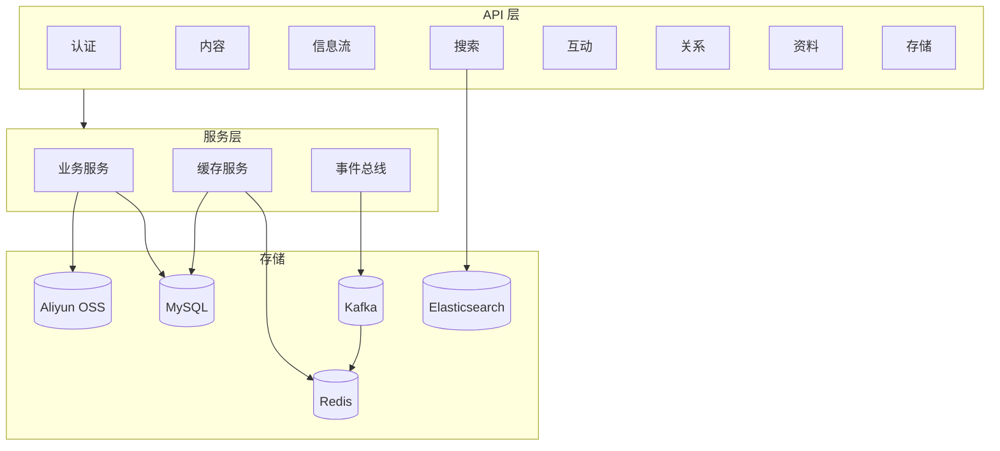

# MindShare

知识获取与分享社区后端服务。

## 技术栈

| 层 | 技术 |
|---|---|
| 后端框架 | Java 21, Spring Boot 3.3, Maven |
| 安全认证 | Spring Security, OAuth2 Resource Server, RSA JWT 双令牌 |
| 数据库 | MySQL 8, MyBatis 3, HikariCP |
| 缓存 | Caffeine L1 + Redis L2, 热点探测动态 TTL |
| 搜索 | Elasticsearch 8, IK 中文分词, 游标分页 |
| 消息 | Kafka, 事务外发模式 (Outbox) |
| 计数 | Redis Bitmap + SDS 紧凑结构 + Lua 原子操作 |
| 存储 | Aliyun OSS, 预签名直传 |
| 分布式 | Redisson (分布式锁 / 限流器) |
| 测试 | JUnit 5, H2, SpringBootTest, 37 用例 |

## 核心功能

- **认证授权**：手机/邮箱验证码注册登录, RSA JWT 双令牌刷新, 密码策略校验, 验证码限频
- **内容发布**：草稿创建 → OSS 直传 → 内容确认 → 元数据编辑 → 发布/删除, 完整生命周期
- **信息流**：公开 Feed + 我的发布, Caffeine + Redis 两级缓存, SingleFlight 防击穿, 细粒度定向失效
- **全文搜索**：IK 中文分词, BM25 相关性 + 互动计数排序, 正文片段高亮, 游标深分页, 搜索建议
- **互动计数**：Redis Bitmap 幂等点赞/收藏, Kafka 异步聚合, Redisson 分布式锁重建, 指数退避
- **社交关系**：关注/取关, 互关判断, 粉丝列表分页, 用户维度计数器
- **对象存储**：OSS 预签名 PUT URL, 所有权校验, 头像上传
- **异步解耦**：Outbox 事务外发模式, 轮询消费, 搜索索引最终一致

## 架构概览



## 模块地图

```
src/main/java/com/mindshare/
├── auth/           认证授权 (JWT, 验证码, 密码策略)
├── user/           用户领域 (实体, Mapper, 服务)
├── profile/        用户资料 (查询, 修改, 头像)
├── knowpost/       内容发布 (草稿, 发布, Feed, Outbox)
├── counter/        互动计数 (Bitmap, SDS, Kafka 聚合)
├── search/         全文搜索 (IK 分词, 游标分页)
├── relation/       社交关系 (关注, 粉丝, 状态)
├── storage/        对象存储 (OSS 预签名)
├── cache/          缓存 (HotKey, 分级配置)
├── common/         通用 (异常, 全局处理)
└── config/         基础设施 (ES, Redisson, 线程池)
```

## 快速启动

```bash
# 1. 准备 MySQL 8
# 2. 执行建表
mysql -u root -p mindshare < db/schema.sql

# 3. 可选：启动 Redis / Elasticsearch / Kafka
#    未启动时对应功能自动降级或禁用

# 4. 启动应用
$env:MYSQL_HOST="localhost"
$env:MYSQL_PORT="3306"
$env:MYSQL_DB="mindshare"
$env:MYSQL_USER="root"
$env:MYSQL_PASSWORD="root"
mvn spring-boot:run

# 5. 运行测试
mvn test
```

## 配置要点

核心开关 (`src/main/resources/application.yml`)：

| 属性 | 说明 |
|---|---|
| `mindshare.cache.redis-enabled` | Redis 二级缓存 |
| `mindshare.counter.redis-enabled` | Redis 计数存储 |
| `mindshare.elasticsearch.enabled` | ES 搜索索引 |
| `mindshare.redisson.enabled` | Redisson 分布式锁 |

测试环境默认使用 H2 内存库，关闭 Redis / ES / Kafka。

## 文档

- [API 接口总览](docs/api-phase1.md)
- [本地运行手册](docs/runbook-local.md)
- [参考项目差距分析](docs/2026-04-21-mindshare-vs-zhiguang-gap-analysis.md)

## License

MIT
